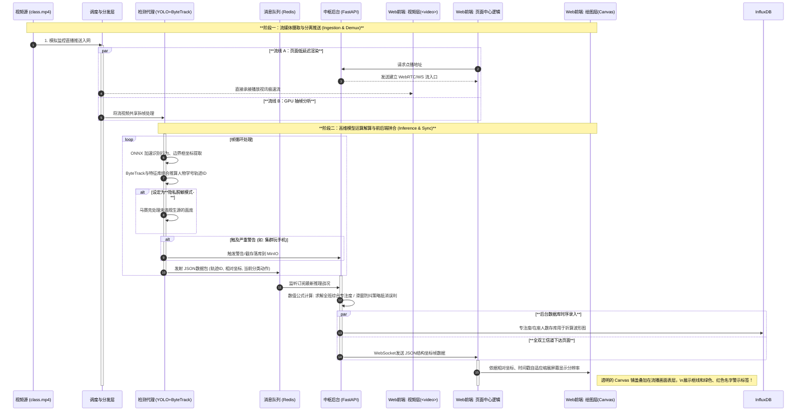

# 一、系统整体架构设计

本系统（慧眼课堂）旨在通过计算机视觉与深度学习技术，在无感知的状态下实时评估课堂教学质量。整体架构设计严格遵循高内聚、低耦合的模块化设计理念，旨在解决实时性要求高、AI推理性能瓶颈以及大数据量并发读写等核心痛点。

### 1.1 系统分层总体架构图 (System Layered Architecture Diagram)

此图参考学术界物联网/CPS系统常见的四层架构模型进行设计，强调模块解耦与职责分工。**注：受限于当前硬件场地环境，感知层本应为真实的教室 IPC 摄像头，当前演示与开发阶段由本地视频 `class.mp4` 以硬核视频流形式模拟推流替代。**

```mermaid
graph TB
    %% 定义样式
    classDef perception fill:#f9f,stroke:#333,stroke-width:2px,color:#000;
    classDef network fill:#ccf,stroke:#333,stroke-width:2px,color:#000;
    classDef processing fill:#ff9,stroke:#333,stroke-width:2px,color:#000;
    classDef application fill:#9f9,stroke:#333,stroke-width:2px,color:#000;
    classDef storage fill:#ddd,stroke:#333,stroke-width:1px,stroke-dasharray: 5 5,color:#000;
    classDef external fill:#eee,stroke:#333,stroke-width:1px,color:#999;

    subgraph AppLayer [L4. 应用展示层 (Application Layer)]
        direction TB
        Frontend[Web 前端 SPA]:::application
        subgraph FE_Tech [Vue 3 + TypeScript + Vite]
            UI[UI 组件库: Element Plus]
            Viz[可视化: Apache ECharts]
            RTC_Client[WebRTC/Video 流推拉端]
        end
        Frontend --> UI
        Frontend --> Viz
        Frontend --> RTC_Client
    end

    subgraph ProcessingLayer [L3. 数据处理与智能层 (Processing & Intelligence Layer)]
        direction TB
        
        subgraph Backend [业务后端核心]
            FastAPI[FastAPI 异步框架]:::processing
            Auth[Token 鉴权服务]
            WS_Server[WebSocket 服务端]
            ReportEngine[AI 评语生成代理]
        end

        subgraph AI_Engine [AI 视觉引擎]
            YOLO_Service[YOLOv11/v10 检测代理]:::processing
            ONNX[ONNX Runtime加速引擎 (GPU)]
            PrivacyFilter[隐私脱敏处理/特征绑定]
        end
        
        RedisMQ[消息中间件: Redis Pub/Sub]:::processing
    end

    subgraph StorageLayer [横向支撑: 数据与存储层 (Data & Storage Layer)]
        MySQL[(MySQL 8.0\n结构化业务数据)]:::storage
        InfluxDB[(InfluxDB\n时序行为数据)]:::storage
        RedisCache[(Redis Cache\n热点数据/Token)]:::storage
        MinIO[(MinIO\n违规快照对象存储)]:::storage
    end

    subgraph NetworkLayer [L2. 核心网络与流媒体层 (Network Layer)]
        StreamServer[流传输/调度服务]:::network
        Signaling[Ws/WebRTC 信令]:::network
    end

    subgraph PerceptionLayer [L1. 感知层 (Perception Layer)]
        VideoSource[本地源视频 class.mp4]:::perception
    end

    subgraph ExternalServices [外部服务]
        LLM_API[外部大模型 API (e.g., GPT/Gemini)]:::external
    end

    %% --- 核心主要链路 ---

    %% 1. 视频流接入与分发
    VideoSource -- "模拟监控流推送" --> StreamServer
    StreamServer -- "低延迟音视频下发" --> RTC_Client
    RTC_Client -.-> Signaling
    Signaling -.-> StreamServer

    %% 2. AI 推理链路
    StreamServer -- "拆分帧分发" --> YOLO_Service
    YOLO_Service -- "底层推理运算" --> ONNX
    ONNX -- "原始检测框与分类" --> YOLO_Service
    YOLO_Service -- "合并行为关联JSON" --> RedisMQ
    
    %% 3. 数据流转与落地
    RedisMQ -- "高速订阅" --> FastAPI
    FastAPI -- "专注率频频写入" --> InfluxDB
    FastAPI -- "人员考勤录入" --> MySQL
    FastAPI -- "状态暂存刷新" --> RedisCache

    %% 4. 前端交互
    Frontend -- "API 互动 (如调换.pt模型)" --> FastAPI
    FastAPI -- "WebSocket 推送画框坐标" --> WS_Server
    WS_Server --> Frontend
    
    %% 5. 特殊联动服务
    YOLO_Service -- "警报证据截图落地" --> MinIO
    FastAPI -- "包裹上下文Prompt传参" --> LLM_API
    LLM_API -- "拉取智能教育反馈" --> FastAPI

    %% 6. 数据闭环强化模型
    Frontend -- "打标反馈事件" --> FastAPI
    FastAPI -- "异常池记录入库" --> MySQL
    MySQL -.->|"为未来模型微调充当Hard Example"| AI_Engine
```

### 1.2 核心低延迟流媒推送与 AI 推理同步设计图

此图聚焦于系统解决的最前沿难点：如何让视频层流转的前端页面与 AI 服务传来的分析坐标高度吻合！

**核心设计思路：**
- **流媒体异步解耦分发：** 接入的视频经过节点后“分叉”，一路维持不转码的方式供用户在浏览器前台流畅观看，一路交予 YOLO 模型去执行厚重的逐帧密集特征计算。
- **坐标相对化与前端渲染：** AI 推理输出完全绑定帧时间戳，并携带转化为 `[0~1.0]` 的百分比相对坐标。前端借助此 JSON 在透明的 Canvas 图层精准描绘（叠加于 `<video>` 之上），避开了传统的在视频流中“二次画框转码（Re-encoding）”产生的超级延迟。



### 1.3 架构设计关键点解析 (Technical Highlights)

1. **零转码极速同屏显示方案：**
   通过 Canvas 透明绘制层叠加在底层 `class.mp4` 解析来的裸视频流上，完全摒除了后端给视频每一帧硬“烧”上外框后再次压缩带来的沉重延迟。前端 WebSocket 承接的数据不仅快，并且采用规范化约束使得无论是手机宽屏与监控室 4K 电视大屏，坐标都不会突变扭曲。

2. **从检测到追踪再到个体的 AI 跨维闭合：**
   YOLO 仅仅解决了寻物盲盒问题，我们利用了 ByteTrack 分配目标标识号，搭配底部的 ArcFace 1:N 人像特征库对比，才能产出诸如“张三：玩手机 - 学生扣分告警”的完整个体评估逻辑，使得整个生态的考勤和统计有了精准闭源落脚点。

3. **应对高强度写入的数据分崩离析 (MySQL x InfluxDB)：**
   面对 1秒出产数次的多目标检测状况数据（诸如班级状态实时变迁曲线），传统 MySQL 会立刻崩溃锁表。系统明确制定引入 `InfluxDB` 来消化吞吐流，而保持 `MySQL` 只做关键排课和人员账号约束的数据界限。

4. **人机协同反馈与自适应优化 (Data Loop Flywheel)：**
   我们的系统是具备迭代升级潜力的体系。在 [系统设置] 开出双路模型热切换 `yolov11.pt` 与 `yolov12.pt` 观察表现的同时，前端预留的误报修正机制，会化为错题本落库为“困难微调样本(Hard Examples)”。随着数据的长效累积，AI判断会逐渐针对本教室环境达成 99%+ 的变态级准确率。


# 二、技术栈
### 1. 前端展示层 (Frontend)

- **核心框架：** **Vue 3 (搭配 TypeScript)**。保证中大型后台项目的代码可维护性。
    
- **UI 组件库：** **Element Plus**。目前生态最完善的 Vue 3 后台组件库，能快速搭建你截图中的各类面板和表格。
    
- **可视化图表：** **Apache ECharts**。处理截图中的热力图、桑基图、动态折线图的绝对首选，性能好且定制化程度极高。
    
- **视频流拉取：** **WebRTC API**。为了实现真正的“实时”监控，摒弃高延迟的 HLS，直接使用 WebRTC 在浏览器端拉取极低延迟的视频流。
    

### 2. 后端与流媒体层 (Backend & Streaming)

- **核心业务框架：** **FastAPI**。Python 生态中性能极高的异步框架，且能无缝、低成本地调用 Python 编写的 AI 推理脚本。
    
- **流媒体处理与分发：** 考虑到目前场地限制，**无法接入真实的教师摄像头**，系统采用本地视频文件（`class.mp4`）作为监控视频源。该视频会以视频流的形式模拟硬核流媒体推送，交由后端的 YOLO 模型进行实时处理，处理完成后的视频流（带有检测框标注）和统计结果会同步返回给前端进行行为统计与大屏展示。
    

### 3. AI 视觉引擎层 (AI Engine)

- **核心视觉模型（行为检测）：** **YOLOv11 与 YOLOv10**。项目中目前已经训练好了 YOLOv11 和 YOLOv10 两个版本的模型（权重文件分别为 `./yolov11.pt` 和 `./yolov12.pt`），系统暂时支持在这两个模型之间进行自由切换，以对比评估检测效果。模型的核心任务是接收并处理视频流，实时识别学生的 **6种行为**，并精准输出每个学生的边界框和行为类别。
    
- **身份绑定与追踪模型（必备拓展）：** **ByteTrack + ArcFace**。纯 YOLO 只能实现“匿名检测”（只知道这里有个人违规，不知道是谁）。为了将检测到的行为与具体的“张三”、“李四”绑定以实现智能考勤和个人画像，必须引入多目标追踪（ByteTrack，确保视频帧间同一个人的稳定追踪，分配唯一 Track ID）以及人脸识别特征比对（ArcFace，将 Track ID 与注册库中的学号进行特征向量 1:N 检索绑定）。

- **推理加速引擎：** **ONNX Runtime**。不要在生产环境直接用 PyTorch 跑推理。将训练好的 YOLO 模型导出为 ONNX 格式，使用 ONNX Runtime 结合 GPU 可以大幅拉高处理帧率（FPS）。
    

### 4. 数据与存储层 (Database & Storage)

- **当前状态说明：** **目前系统暂未接入正式数据库**，项目整体功能直接使用 `.pt` 模型文件在内存中推理解析 `class.mp4` 视频流，实时统计学生的 6 种行为类别交由前端展示。
- **未来存储规划：** 随着功能演进，所有的实时行为统计、考勤以及人员信息都必须落地持久化，以下为预设的存储架构：
- **关系型数据库：** **MySQL 8.0**。存储人员名单、课程表、系统账号、考勤状态等结构化业务数据。
    
- **时序数据库：** **InfluxDB**。**必选项。** 系统每秒都在产生行为分类、各类学生的实时状态数据，用关系型数据库存取极其容易崩溃。InfluxDB 专为这种高频写入和折线图聚合查询而生。
    
- **缓存与消息中间件：** **Redis**。用于缓存当前课表状态、Token 鉴权，同时可以作为 FastAPI 业务端与 AI 推理端之间的轻量级消息队列。
    
- **对象存储：** **MinIO**。轻量级的私有化云存储，专门用来存放触发预警时抓拍的违规证据截图。
    

### 5. 部署架构 (Deployment)

- **容器化底座：** **Docker & Docker Compose**。将上述所有的微服务、数据库、前端统统容器化，保证开发环境和未来学校私有化部署时的环境 100% 一致，避免“在我的电脑上明明能跑”的尴尬。


# 三、 系统功能清单 (PRD)

#### 1. 系统工作台 (System Dashboard)

**定位：** 教师或管理员登录后的系统首页，提供全局视角的“驾驶舱”。

**具体功能：**

- **今日课程速览：** 以时间轴或卡片形式展示当前账号今天的课表（如：08:00 高一二班 数学），并动态高亮当前正在进行的课程。
    
- **核心数据看板：** 顶部放置 4 个核心数据卡片，展示本周累计上课时长、平均出勤率、全校/全班平均专注度得分、待处理的异常预警数量。
    
- **快捷操作入口：** 提供大按钮直达高频操作区，如“一键开启当前课堂监控”、“导出昨日考勤表”、“录入新学生信息”。
    
- **最新动态/通知：** 列表展示系统级的通知（如“系统版本更新提示”或“YOLO 模型已升级至最新版”）。
    

#### 2. 课堂监测 (Real-time Monitoring)

**定位：** 系统的核心硬核能力展示区，展示实时 AI 视觉分析能力。

**具体功能：**

- **双栏实时监控：** 左侧为视频流实时渲染区，画面上叠加 YOLOv11 的实时检测框和状态标签（如“听讲”、“趴桌”、“玩手机”）。底部配有“开启/停止/截屏”控制台。
    
- **[新增优化] 隐私脱敏模式：** 监控区提供“脱敏模式”开关。开启后，非违规学生的面部会自动打码（或仅渲染骨架/色块），仅在触发违规预警时才清晰记录，最大程度保护学生隐私。
    
- **动态数据流看板：** 右侧实时刷新当前画面的统计数据（总人数、专注人数、游离人数）。
    
- **实时滚动日志：** 类似终端的滚动文本框，实时播报检测到的事件（如：“10:15:23 - 后排检测到疑似玩手机行为”）。
    

#### 3. 智能考勤 (Smart Attendance)

**定位：** 替代传统的点名环节，利用人脸检测/目标追踪实现静默考勤。

**具体功能：**

- **应到与实到比对：** 页面顶部显示“应到人数”、“实到人数”、“缺勤人数”的对比环形图。
    
- **考勤状态清单：** 以数据表格形式展示全班名单，每个人对应一个状态标签（✅ 已签到、❌ 缺勤、⚠️ 迟到/早退）。
    
- **人工校对机制：** 表格最后提供“手动修改状态”按钮，允许教师纠正 AI 的漏检错检。
    
- **[新增优化] 未知人员登记区：** 设立专门的“异常/未知人员”面板，抓拍并列出戴口罩、走错教室或临时调座导致系统无法识别的人脸，方便老师快速核实并手动关联。
    
- **一键导出：** 支持将当前考勤表格导出为 Excel 或 CSV 格式。
    

#### 4. 课后评估 (Post-class Report & AI Insights)

**定位：** 课后的复盘神器，将冰冷的数据转化为有温度的教学建议。

**具体功能：**

- **专注度时间轴曲线：** 折线图展示 45 分钟课堂内专注人数比例的变化。直观暴露学生在哪一分钟开始疲劳走神。
    
- **行为分布饼图：** 统计整堂课所有学生的行为占比（如：60% 抬头听讲，10% 趴桌等）。
    
- **AI 智能评语生成器：** 后台调用大语言模型（如 Gemini、GPT）生成结构化评语。
    
- **[新增优化] 丰富的上下文 Prompt：** 传给 LLM 的数据不仅包含学生行为统计，还会自动打包**“课程科目”、“上课时间段（如易困的下午第一节）”**以及老师输入的**“本节课教学重难点”**。让 AI 给出的建议更精准、更有温度（例如：“下午第一节课学生易犯困，且本节为复杂的立体几何，20分钟后低头率激增，建议下次在此节点插入互动提问”）。
    

#### 5. 学生个人画像 (Student Profile)

**定位：** 从“宏观群体”下钻到“微观个体”，实现因材施教。

**具体功能：**

- **个体搜寻与信息卡：** 左侧为搜索栏与名单，点击后右侧展示基本信息和历史出勤率。
    
- **行为偏好雷达图：** 展示该学生在不同维度（专注力、互动活跃度、纪律性、抗疲劳度）的综合表现得分。
    
- **历史趋势追踪：** 展示该学生近一个月的听课专注度折线图。
    
- **[新增优化] 班级基准线对比：** 在该学生的折线图和雷达图上，**强制叠加一条“班级平均水平”的基准线**。帮助老师一眼看出该生是自身状态下滑，还是受全班整体氛围影响。
    

#### 6. 异常预警与安全中心 (Alert & Security)

**定位：** 聚焦违规行为和安全隐患，提供追溯证据与模型迭代数据。

**具体功能：**

- **预警事件墙：** 以卡片瀑布流形式展示历史预警（如：长时间离开座位、群体性趴桌）。
    
- **抓拍留痕：** 每一个预警卡片附带一张触发 YOLO 警报的视频帧截图。
    
- **预警规则配置：** 允许自定义触发规则（如：“画面中玩手机人数 > 3 人时，触发严重预警”）。
    
- **[新增优化] AI 反馈闭环（人工打标）：** 在每张抓拍截图下增加 **“✅ 确认违规”** 和 **“❌ 误报忽略”** 两个按钮。老师的点击动作会记录在后台，作为“难样本数据（Hard Examples）”保存，未来可用于重新微调（Fine-tune）YOLOv11 模型，让系统越用越准。
    

#### 7. 系统设置与模型管理 (Settings & Model Config)

**定位：** 面向管理员的底层配置与合规管理页面。

**具体功能：**

- **视觉模型配置：** 提供滑块调整模型的 置信度 (Confidence) 和 交并比 (IoU)，并且支持下拉**自由切换目前的两个预训练权重模型文件：`./yolov11.pt` 与 `./yolov12.pt`**。
    
- **视频源管理：** 配置用于处理测试的 `class.mp4` 文件路径（暂无摄像头情况使用）。
    
- **硬件性能监控：** 显示当前服务器的 CPU/GPU 占用率、内存使用情况及视频流 FPS。
    
- **第三方服务接入：** 填写和测试大语言模型（LLM）的 API 接口地址和密钥。
    
- **[新增优化] 数据留存与合规设置：** 增加“数据自动清理周期”选项（例如设定：课堂视频流不保存，违规抓拍截图保留 30 天后自动物理销毁），以满足教育行业的数据安全与合规要求。


# 四、 核心算法指标与逻辑定义 (Algorithm Definitions)

#### 1. 6 种行为标签定义与边界 (Action Class Labels)
为了防止模型误判和前端展示歧义，明确规范系统支持的 6 种检测类别及其判定边界：
1. **专注听讲 (Listening - 专注)：** 视线朝向讲台/黑板，身体前倾或端正坐立。
2. **阅读/记笔记 (Reading_Writing - 专注)：** 视线朝向桌面，且有手部握笔或翻书动作（区分于单纯低头发呆）。
3. **低头/趴桌 (Sleeping - 游离)：** 头部紧贴桌面，或长时间极度低头（在此状态下骨骼关键点中，鼻尖点纵坐标异常偏下），视为严重走神。
4. **左顾右盼 (Looking_Around - 游离)：** 头部偏航角（Yaw）或俯仰角（Pitch）长期偏离正前方，且无互动迹象，视为注意力分散。
5. **玩手机/电子产品 (Using_Phone - 违规)：** 手持长方体发光物且视线长时间聚焦手部（这是典型的硬性违规行为，必须抓拍并作为极难样本）。
6. **起立/离开 (Standing_Leaving - 异常)：** 目标边界框（BBox）的高宽比发生剧烈变化，或者目标 Track ID 在规定的课桌坐标系内消失。

#### 2. “专注度”的数学计算机制 (Attention Score Formula)
大屏看板中的“平均专注度得分”需基于绝对严谨的数学公式。这里采用加权计算法（满分 100 分）：
$$ \text{Attention Score} = \left( \frac{W_1 \cdot N_{\text{听讲}} + W_2 \cdot N_{\text{笔记}}}{N_{\text{总认出人数}}} \right) \times 100 $$
- **分母（$N_{\text{总认出人数}}$）：** 为当前画面中有效识别追踪到的学生总数。
- **分子（权重建议）：** 设定 $W_1 = 1.0$ (听讲), $W_2 = 1.0$ (记笔记/阅读) 作为纯正向得分。游离状态如“趴桌/左顾右盼”由于不在此分子中，天然起拉低得分的作用；而“玩手机”等严重纪律违规项除了不算分，还应引入额外的扣分惩罚（例如：若画面中存在此行为，班级总得分减去 2~5 分/人次直至及格线）。


# 五、 数据契约与接口规范 (Data Contracts & APIs)

前端与后端并行开发的“插座”：

#### 1. RESTful API 规范示例 (Swagger 摘录)
- **获取班级实时考勤列表 (GET `/api/v1/attendance/{class_id}/live`)**
  - **Req:** `Query: ?course_id=123`
  - **Res:** `200 OK`, Payload: `{ "code": 0, "data": [ { "student_id": "202301", "name": "张三", "status": "PRESENT" } ] }`
- **大模型课后评语生成 (POST `/api/v1/reports/generate`)**
  - **Req:** `Body: { "class_id": "ClassA", "course_time": "14:00-14:45", "focus_data": [...] }`
  - **Res:** `200 OK`, Payload: `{ "code": 0, "data": { "report_text": "在易困时间段表现...", "suggested_tags": ["需加强互动"] } }`

#### 2. WebSocket 实时数据帧格式 (Data Frame)
前端通过 WebSocket 接收高频最新的检测包，用于渲染视频叠层。**为兼容不同分辨率屏幕的大屏开发，坐标一律使用「相对坐标 (0.0~1.0)」**。
```json
{
  "timestamp": 1711342805000,
  "frame_id": 1056,
  "metrics": { "total": 45, "focus": 40, "distracted": 5, "score": 88.5 },
  "objects": [
    {
      "track_id": "T05",
      "student_id": "202301", // 人脸识别(ReID)结合轨迹对比后得到的学号
      "bbox": [0.15, 0.45, 0.08, 0.12], // [x_center, y_center, width, height]
      "action": "Listening", // 上文定义的6种行为标签之一
      "confidence": 0.92
    }
  ]
}
```

#### 3. 核心数据库物理模型 (DDL Schema)
虽然当前暂未接入完整数据库，但为后续研发制定了明确的 MySQL 建表规范，涵盖关键业务的字段类型与约束：

```sql
-- 1. 学生配置表 (Student Profile)
CREATE TABLE `sys_student` (
  `student_id` VARCHAR(32) NOT NULL COMMENT '学号(自增/学籍号)',
  `name` VARCHAR(64) NOT NULL COMMENT '学生姓名',
  `class_id` VARCHAR(32) NOT NULL COMMENT '所属班级ID',
  `face_feature_vector` BLOB COMMENT '人脸特征张量(ArcFace提取)，用于比对',
  `created_at` DATETIME DEFAULT CURRENT_TIMESTAMP,
  PRIMARY KEY (`student_id`),
  INDEX `idx_class` (`class_id`)
) ENGINE=InnoDB DEFAULT CHARSET=utf8mb4 COMMENT='学生基础库与人脸库';

-- 2. 课程排课表 (Course Schedule)
CREATE TABLE `bus_course_schedule` (
  `schedule_id` BIGINT AUTO_INCREMENT COMMENT '排课记录ID',
  `class_id` VARCHAR(32) NOT NULL COMMENT '上课班级',
  `teacher_id` VARCHAR(32) NOT NULL COMMENT '授课教师',
  `subject` VARCHAR(64) NOT NULL COMMENT '科目(如:数学)',
  `start_time` DATETIME NOT NULL COMMENT '计划开始时间',
  `end_time` DATETIME NOT NULL COMMENT '计划结束时间',
  PRIMARY KEY (`schedule_id`)
) ENGINE=InnoDB DEFAULT CHARSET=utf8mb4 COMMENT='每日课程排期表';

-- 3. 行为考勤日志表 (Attendance & Behavior Log)
CREATE TABLE `bus_attendance_log` (
  `log_id` BIGINT AUTO_INCREMENT,
  `schedule_id` BIGINT NOT NULL COMMENT '关联的课程ID',
  `student_id` VARCHAR(32) NOT NULL COMMENT '学生学号',
  `status` ENUM('PRESENT', 'LATE', 'ABSENT') DEFAULT 'ABSENT' COMMENT '总体签到状态',
  `check_in_time` DATETIME COMMENT '首次被AI识别到的时间',
  PRIMARY KEY (`log_id`),
  INDEX `idx_schedule_student` (`schedule_id`, `student_id`)
) ENGINE=InnoDB DEFAULT CHARSET=utf8mb4 COMMENT='考勤结果表';
```


# 六、 业务规则与边缘场景兜底 (Business Rules & Edge Cases)

#### 1. 考勤状态的时间线规则 (Timeline Logic)
系统自动进行的静默考勤并非瞬间判定，需具备合理的时间容错窗口：
- **已签到 (✅ PRESENT)：** 课程开始前 10 分钟至开始后 5 分钟内，只要有一帧 ReID 匹配成功且置信度 $> 0.85$，即刻锁定该人为已签到。
- **迟到 (⚠️ LATE)：** 课程开始 5 分钟后至 20 分钟期间，系统首次在此视频流中通过特征比对识别到该人。
- **缺勤 (❌ ABSENT)：** 课程开始 20 分钟后，该学生的特征向量始终未在画面中稳定出现（即未建立持续 30 帧以上的有效追踪 Tracking），将被彻底标记为缺勤。

#### 2. 异常预警阈值与防抖机制 (Debounce & Threshold)
如果一个学生只是低头看了一眼手表或捡个笔就被警报“趴桌/游离”，监控系统将毫无可用价值并充斥误报。必须在推送与存库前引入滑动时间窗防抖 (Temporal Window Debouncing)：
- **防抖过滤规则：** 对于同一个 Track ID，其某种被识别出的违规/游离行为必须在过往的连续评估周期内（如 30 秒/10 FPS 则为最近 300 帧中），此行为判定**占比超过 80%**，才触发正式警报防抖通行，并落库。
- **升级阈值干预：** 若触发特定紧急群体事件，如“单画面中识别出 `Using_Phone` 的人数 > 3 人”，则无视单人的 30 秒防抖队列，立刻触发“**群体性纪律异常预警**”并截取关键帧推送给系统控制台。

#### 3. LLM 课后分析的 Prompt 模板结构 (LLM Context)
在传给大模型（如 GPT/Gemini）获取建议时，明确的上下文能避免其生产出“正确的废话”。模板示例：
```text
【系统指派】：你是资深的教育心理学与教学质量督导专家。请根据以下截取的课堂监测数据，为授课教师生成一段300字以内的复盘建议。
【课程背景】：科目：数学；时间段：14:00-14:45（处于下午人体易困阶段）。
【教学重难点】（老师输入项）：本节课后20分钟开始攻坚立体几何，逻辑密度大。
【行为数据快照】：实到45人。前20分钟听讲/记笔记占比及专注度为 92%；后20分钟专注度跌落至 65%（其中15人出现不同程度的“趴桌”或“左顾右盼”，防抖已过滤误判）。
【输出要求】：不得机械罗列数据。请以人性和心理学视角直指异常节点成因，并给出具体的引导与节奏分配策略（切勿用Markdown废话，直接出诊断报告）。
```


# 七、 界面交互与 UI/UX 资产设计 (UI/UX Assets)

在前端落地环节，不能仅凭借组件库简单堆砌，需建立严肃的标准 UI/UX 设计规范。以下为前端设计对接标准：

- **高保真设计资源 (Design Specs)：** 
  - 必须通过 Figma 提供开发级别的高保真设计稿。
  - **主题调色板与尺寸：** 工作台与视频监测页强制使用深色系统面板 (Dark Theme)，主背景色 `#141414`，面性卡片背景色 `#1D1E1F`，边框线色 `#333333`。所有的内边距(Padding)和外边距(Margin)必须基于 `8px` 网格系统递增 (例如 8, 16, 24, 32)。
  - **关键状态色值：** 基于视觉心理学限制预警颜色的使用，绿色 `#67C23A`标示听讲，红色 `#F56C6C`高亮“玩手机等严重提醒”，黄色 `#E6A23C`留给走神与游离状态。
  - **响应式断点 (Breakpoints)：** 按 `xs(<768px不可用)`, `sm(≥768px)`, `md(≥992px)`, `lg(≥1200px)`, `xl(≥1920px指挥大屏)` 进行布局切换。保障视频流区域在各种分辨率下强制维持 16:9 画幅。

- **可视化组件配置与动效 (ECharts Animations)：**
  - **图表细节配置：** ECharts 折线图/专注度趋势图必须关闭默认坐标轴线（只保留 AxisLabel），线条平滑须开启 `smooth: true`，线条下方加入由主题色到透明的 `areaStyle` 渐变填充。
  - **数字心跳动效：** 顶部看板承接 WebSocket 高频推送(如 10 Hz)时，禁止数字生硬跳变。必须接入 `VueUse` 中的 `useTransition` 实现缓动动画计算滚动更新，保持系统极具生命力的“科技感”。

# 八、全局色彩基调与视觉层级 (Color Palette & Visual Hierarchy)

为了契合“AI 视觉分析”的前沿科技定位，并对标国内顶尖计算机设计大赛的视觉标准，本系统采用 **“深空极智 (Deep Space Intelligence) —— 赛博青蓝”** 为核心主题色彩规范。该配色方案旨在降低教师长时间监控的视觉疲劳，同时利用高对比度让违规行为在第一时间跃入眼帘。

- **🌌 空间基底色 (Base Backgrounds)：** 摒弃死板的纯黑，采用带有深度空间感的暗蓝色系。
    
    - **全局背景 (App Background)：** `#0B101E`（深空极夜蓝），营造沉浸式的数据座舱氛围。
        
    - **面板/卡片底色 (Surface/Cards)：** `#161D2C` 配合 `20%` 纯白描边（Glassmorphism 微拟物玻璃态），用于区分不同功能模块，保持界面的呼吸感。
        
- **💠 品牌主干色 (Primary Tech Vibe)：** * **核心青蓝 (Tech Cyan)：** `#00F2FE`。用于激活状态、选中项、数据大屏的主标题下划线以及正常运作的科技动效（如呼吸灯）。
    
    - **渐变强调 (Gradient Accent)：** 核心数据折线图的面积填充强制使用 `#00F2FE` 到完全透明的垂直线性渐变，拉满数据流动感。
        
- **🚨 语义预警色 (Semantic & Alert Colors)：** 在 AI 监控视频流的边界框（BBox）和抓拍警报中，实行严格的色彩心理学映射。
    
    - **正常/专注 (Safe - 绿色)：** `#00E676`（霓虹绿）。用于“听讲/记笔记”的标签框，色彩柔和，不抢夺视线。
        
    - **游离/边缘 (Warning - 琥珀色)：** `#FFB300`（高亮黄）。用于“趴桌/左顾右盼”等软性走神行为，起到警醒作用。
        
    - **违规/严重 (Danger - 荧光红)：** `#FF2A55`（赛博洋红）。专用于“玩手机”或“群体离座”等绝对违规行为。高饱和的红色在暗色背景下具有极强的视觉穿透力，确保管理员零延迟捕获异常。
        
- **🖋️ 文本层级 (Typography Colors)：** * 主标题/核心数字：`#FFFFFF`（100% 纯白）
    
    - 正文/表头：`#A0AEC0`（冷灰蓝，降低反差防止刺眼）
        
    - 禁用/占位符：`#4A5568`

